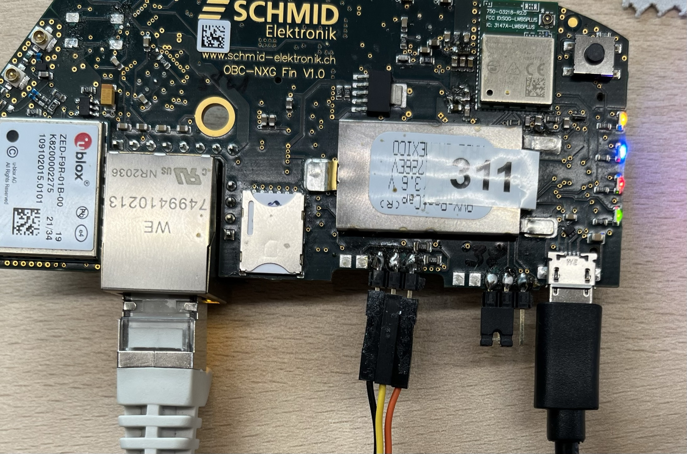
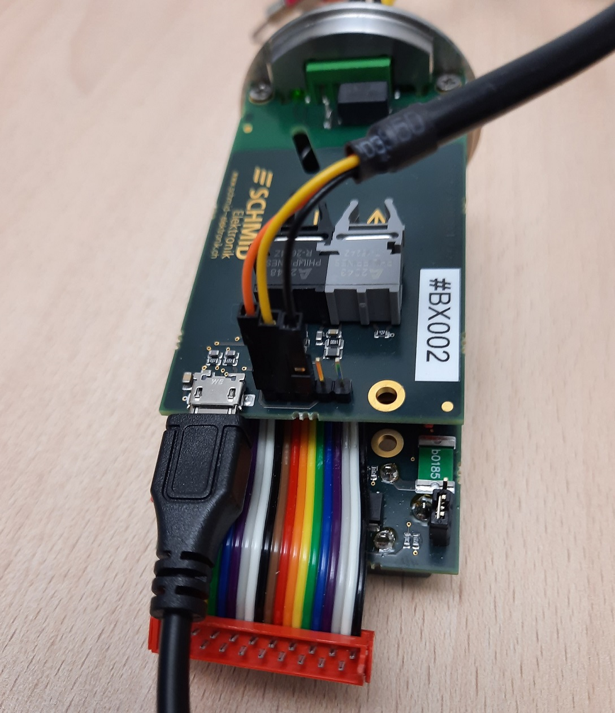

# Readme

This Layer customizes the Karo Layer for the OBC NGX devices.

Some entry points;

- [initial BSP setup](https://karo-electronics.github.io/docs/yocto-guide/nxp/setup.html)

- [customize BSB, create Layer, etc](https://karo-electronics.github.io/docs/yocto-guide/nxp/customizing.html)

- [Flash image](https://karo-electronics.github.io/docs/software-documentation/flashtools/stm32-programmer/index.html)

- [The Yocto Manual](https://docs.yoctoproject.org/3.1.20/singleindex.html)

  

## First time setup
Get an Ubuntu 18.04 (20.04 does not work, yocto gatesgarth is not there). WSL2 works

```bash
# get all used tools
sudo apt install gawk wget git diffstat unzip texinfo gcc build-essential chrpath socat cpio python3 python3-pip python3-pexpect xz-utils debianutils iputils-ping python3-git python3-jinja2 libegl1-mesa libsdl1.2-dev pylint3 xterm python3-subunit mesa-common-dev curl python libncurses-dev

# repotool
mkdir ~/bin
curl https://storage.googleapis.com/git-repo-downloads/repo > ~/bin/repo
chmod a+x ~/bin/repo

# add it to bashrc
export PATH=~/bin:$PATH

# get karo distro
mkdir obc-yocto
cd obc-yocto
repo init -u https://github.com/schmid-elektronik/karo-bsp -b gatesgarth
repo sync

# copy following files to  <home>/obc-yocto/release
# get laird releases: https://github.com/LairdCP/Sterling-LWB-and-LWB5-Release-Packages/releases/tag/LRD-REL-9.15.0.14
laird-lwb5plus-sdio-sa-firmware-9.15.0.14.tar.bz2
laird-lwb5plus-usb-sa-firmware-9.15.0.14.tar.bz2 

# get obc-releases: https://github.com/schmid-elektronik/sh-p03-obc-services/releases
obc-services-karo_1.1.8.tar.gz
# check if we have the correct release version (here 1.1.8)
cat ~/obc-yocto/layers/meta-obc-kernel/classes/obc_common.bbclass | grep obc-services-karo

# set machine and build folder, initially you need to run it twice
DISTRO=obc-base MACHINE=qsmp-1570-bb source setup-environment build-obc-1570-bb/

# setup "global" cache- and download-directory (you could set path to a network share)
# in conf/local.conf
DL_DIR ?= "/home/mas/yoctocache/downloads"
SSTATE_DIR ?= "/home/mas/yoctocache/sstate-cache"

# add the KARO cache
SSTATE_MIRRORS ?= "\
    file://.* http://sstate.yoctoproject.org/PATH;downloadfilename=PATH \
    file://.* http://sstate.karo-electronics.de/gatesgarth/PATH \
"

# you manually need to add obc layer in conf/bblayers.conf
${BSPDIR}/layers/meta-obc-kernel \
${BSPDIR}/layers/meta-laird-cp \

bitbake obc-image-bb
```


Manually adding the our own Layers is just a workaround. We could resolve it by providing our own `setup-environment` script

```bash
cp setup-environment <own layer>
cp bblaysers.conf.sample <own layer>
# customize files and add it to the bsp-repo <youbuild>/.repo/manifests/default.xml

# the better option would be cutom template, but its not supported by karo
# https://docs.yoctoproject.org/3.1.19/singleindex.html#creating-a-custom-template-configuration-directory
# https://github.com/karo-electronics/meta-karo/issues/9
```


## Basic Yocto Build

once your set, it's easy..

```bash
# on the prepared VM
cd ~/obc-yocto/
repo sync

# set environment and build backbone
DISTRO=obc-base MACHINE=qsmp-1570-bb source setup-environment build-obc-1570-bb/
bitbake obc-image-bb

# same for fin (make shure to use a different shell)
DISTRO=obc-base MACHINE=qsmp-1570-fin source setup-environment build-obc-1570-fin/
bitbake obc-image-fin
# ---> Flash image

# SDK = compiler, header, ++
bitbake karo-image-bb -c populate_sdk
cd tmp/deploy/sdk 
# deploy/install sdk to /home/karo/bin/karo_sdk/

# to use the toolchain
. /home/karo/bin/karo_sdk/environment-setup-armv7vet2hf-neon-poky-linux-gnueabi
```


## Flash image

Install [STM32 CubeProgrammer](https://karo-electronics.github.io/docs/software-documentation/flashtools/stm32-programmer/index.html)

When working on a Virtual Machine, make sure to use USB Controller 3.1. USB2 will be too slow to flash.

connect USB, Serial FTDI cable and Boot Jumper as in the picture

If working on WSL, consider [connecting USB to WSL](https://learn.microsoft.com/en-us/windows/wsl/connect-usb)




```bash
# Programmer Location = /home/karo/bin/stm32_cube_programmer
# already in PATH

# cd to image folder
cd <BUILD_FOLDER>/tmp/deploy/images/qsmp-1570-

# get USB number
STM32_Programmer_CLI -l usb

# flash image
# ---> set bootmode jumper
STM32_Programmer_CLI -c port=usb1 -w flashlayout_obc-image-fin/FlashLayout_emmc_stm32mp157c-qsmp-1570-trusted.tsv

# from uboot, you can mount this stuff as massstorage
# Does not work since we removed programming usb from devicetree
=> ums 0 mmc 0

# or just modify those partitions directly in system, eg bootpartition
lsblk
mount /dev/mmcblk0p2 /boot/
```


### Setup Karo Module

When using a Karo Module for the first time. The uboot environment needs to be set manually, [since this can not be done with the STM32_Programmer](https://karo-electronics.github.io/docs/software-documentation/flashtools/stm32-programmer/index.html#u-boot-environment).

```bash
# Break into U-Boot prompt again by hitting any key.

# set default environment
env default -a
saveenv
reset

# adapt bootargs and devicetreefile for our needs
setenv append_bootargs 'init=/sbin/init'
setenv dtbfile /stm32mp157c-qsmp-1570-bb.dtb
saveenv

# set use different devicetreefile for Backbone and fin
setenv dtbfile /stm32mp157c-qsmp-1570-fin.dtb

# you may want to remove the 'debug' argumnent in default_bootargs, this will print less on console
setenv default_bootargs 'setenv bootargs console=ttySTM0,115200 ro panic=-1 loglevel=1'
```
